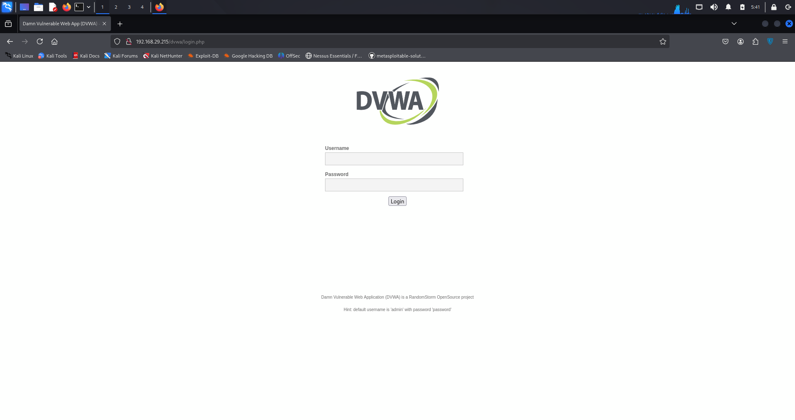
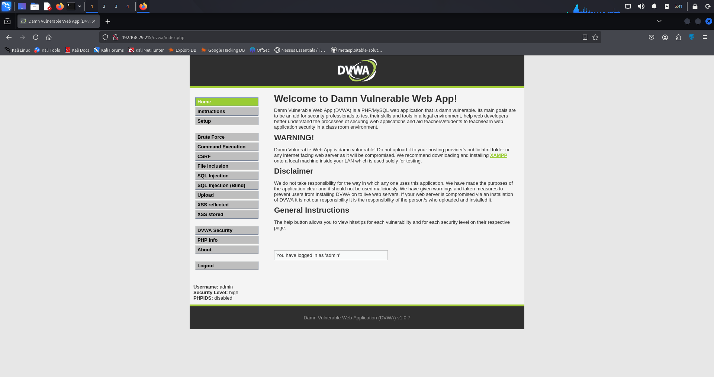
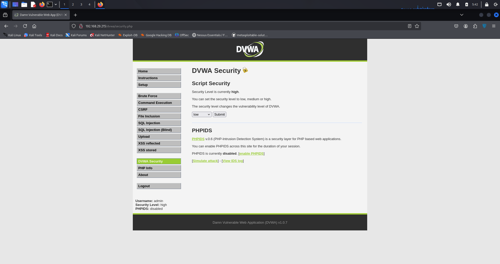
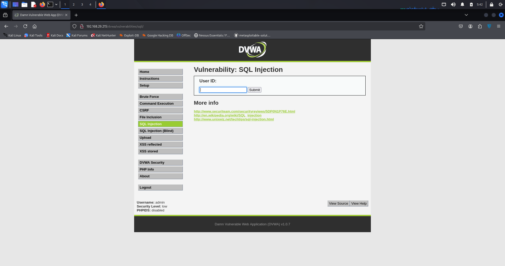
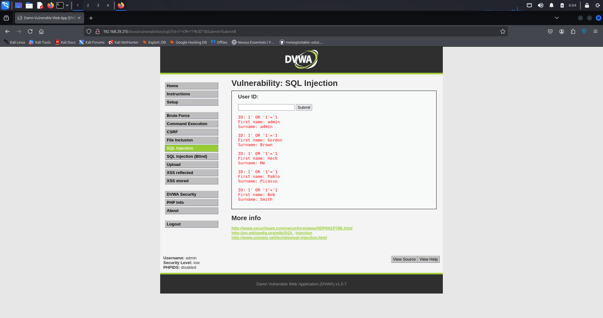
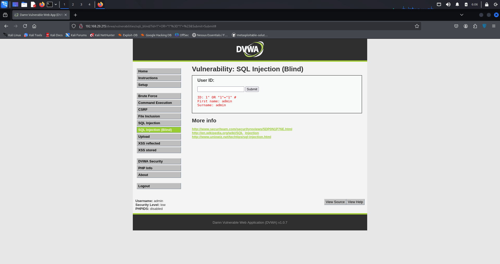

# SQL Injection Demonstration on DVWA - Metasploitable Target

**Target:** Metasploitable VM (192.168.29.215)  
**Attacker:** Kali Linux  

## Overview

This project demonstrates SQL injection vulnerabilities using the Damn Vulnerable Web Application (DVWA) running on a Metasploitable virtual machine. The demonstration showcases how SQL injection attacks work in a controlled penetration testing environment using Kali Linux as the attacking platform.

## What is SQL injection attack
It is a security flaw in web applications where attackers insert harmful SQL code through user inputs. This can allow them to access sensitive data, change database contents or even take control of the system. It's important to know about SQL Injection to keep web applications secure.(From geeksforgeeks).
Basically we use certain condiation based code to trick the site or application into showing the SQL database table

## 📸 Visual Demonstration

### Lab Environment Setup


*Metasploitable VM running and configured*


*Kali Linux penetration testing environment*


*Network connectivity test from Kali to Metasploitable*

### DVWA Access and Configuration


*DVWA login page on Metasploitable (192.168.29.215)*


*DVWA security level configured to "Low"*

### SQL Injection Attack Demonstration


*DVWA SQL Injection vulnerability testing interface*


*SQL injection attack demonstration with results*

## 🔍 Attack Demonstration

### Target Environment
- **Target:** Metasploitable VM (192.168.29.215)
- **Application:** DVWA (Damn Vulnerable Web Application)
- **Vulnerability:** SQL Injection in User ID parameter
- **Security Level:** Low (no input validation)

### Attack Vectors Demonstrated

1. **Boolean-based SQL Injection**
   ```sql
   1' OR '1'='1
   ```
   - Bypasses authentication logic
   - Returns all user records instead of just one

## 🤖 Automated Exploitation

### Running the Exploit Script

The included `sql_injection_exploit.sh` script automates the SQL injection process:

```bash
# Make the script executable
chmod +x sql_injection_exploit.sh

# Run the automated exploit
./sql_injection_exploit.sh
```

### Pleas make user to use th directory in which the file sql_injection_exploit.sh is placed or it may not run.

## 📊 Results and Impact

### Vulnerability Impact
The SQL injection vulnerability allows attackers to:
- **Bypass authentication** mechanisms
- **Extract sensitive data** including user credentials
- **Enumerate database structure** and contents
- **Access unauthorized information**

### Extracted Data Example
```
Database: dvwa
User Credentials Extracted:
- admin: 5e884898da28047151d0e56f8dc6292773603d0d6aabbdd62a11ef721d1542d8
- gordonb: e99a18c428cb38d5f260853678922e03
- 1337: 8d3533d75ae2c3966d7e0d4fcc69216b
- pablo: 0d107d09f5bbe40cade3de5c71e9e9b7
- smithy: 5f4dcc3b5aa765d61d8327deb882cf99
```

## 📁 Project Files

```
SQL Injection/
├── sql_injection_exploit.sh     # Automated exploitation script
├── README.md                     # This documentation
└── screenshots/                  # Visual proof of concept
    ├── 01_metasploitable_vm.png
    ├── 02_kali_linux_setup.png
    ├── 03_network_connectivity.png
    ├── 04_dvwa_login.png
    ├── 05_security_settings.png
    ├── 06_sql_injection_page.png
    └── 07_basic_injection_test.png
```
---
